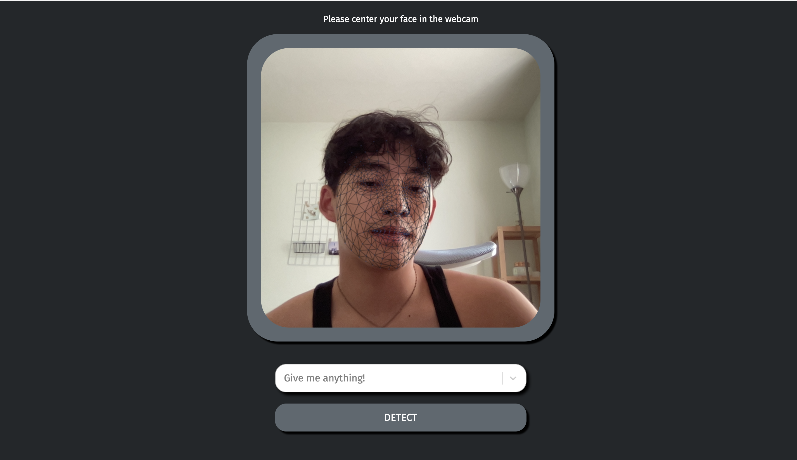
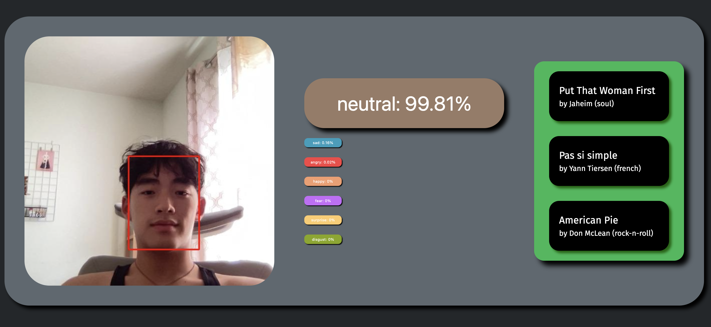
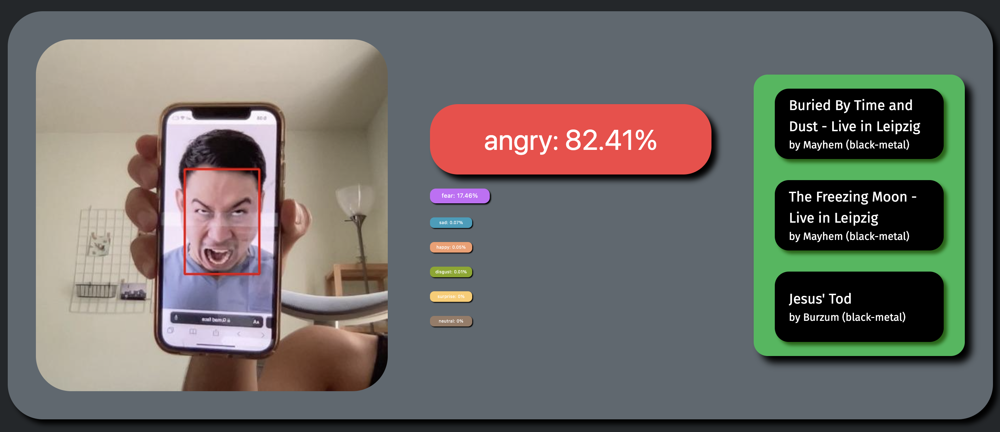

# N(eural)N(etwork)ew Taste
### Soon to be fully deployed!

## Technologies
* __Frontend__: 
  * __ReactJS__ 
  * __TensorflowJS__ (facial landmarking)
* __Backend__: 
  * __Flask__
  * __OpenCV__ (image processing) 
  * __Tensorflow, Caffe, Deepface__ (facial expression analysis) 
  * __NumPy, Pandas__ (web scraping and music recommendation)

## How it works
1. On the frontend, we use TensorflowJS' facemesh model to identify landmarks on the user's face (mainly just to look cool)
2. On detect, a multi-task cascaded convolutional network (MTCNN) checks that a face is present in the image and annotates it.
3. The image is passed to a deep neural network (DNN), courtesy of DeepFace, which produces a list of each emotion and its associated score, which sums to 1.
4. This emotion vector is then converted to a "valence-arousal" score, via some linear algebra and other fun stuff.
5. We then scan the database of songs (~11,500 via Spotify Web API), filtering for the interested genres and sorting by euclidean distance from the user's valence-arousal score.
6. The top 3 songs are returned!

## To do:
* __Dynamic loading__ (check if hooks are still default)
* __Resolve Deepface ValueError__ (create React alert and modify detect_with_deepface())

## Example images (as of 6/15/2022)

